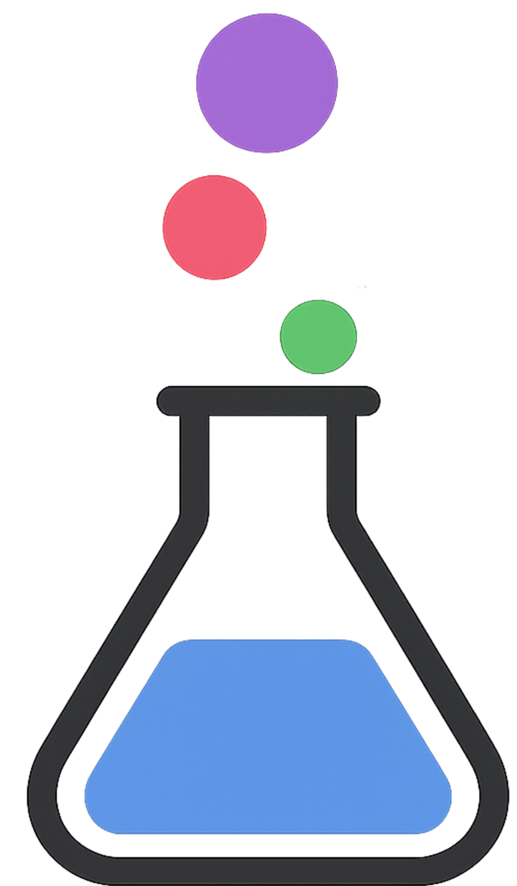

## MoleculeHub: Cheminformatics in Julia

A collection of cheminformatics tools in Julia. 

Currently includes: 

- [MoleculeFlow.jl](https://github.com/MoleculeHub/MoleculeFlow.jl) - Cheminformatics tools in Julia built on top of [RDKit](https://github.com/rdkit/rdkit)
- [MoleculeView.jl](https://github.com/MoleculeHub/MoleculeView.jl) - A library for interactive molecular data visualization and exploration
- [MoleculeDatasets.jl](https://github.com/MoleculeHub/MoleculeDatasets.jl) - A utility library to easily access popular cheminformatics datasets
- [OpenBabel.jl](https://github.com/MoleculeHub/OpenBabel.jl) - Julia bindings to [Open Babel](https://github.com/openbabel/openbabel) library

Other external libraries/organizations of interest: 
- [JuliaMolSim](https://github.com/JuliaMolSim) - Molecular Simulation in Julia
- [BioJulia](https://github.com/BioJulia) - Bioinformatics and Computational Biology in Julia
- [MolecularGraph.jl](https://github.com/mojaie/MolecularGraph.jl) - Graph-based molecule modeling toolkit for cheminformatics
- [CrystalInfoFramework.jl](https://github.com/jamesrhester/CrystalInfoFramework.jl) - Julia tools for reading Crystallographic Information Framework (CIF) files and dictionaries
- [PDBTools.jl](https://github.com/m3g/PDBTools.jl) - Read, write and manipulate atomic systems in PDB and mmCIF formats
- [ChemfilesViewer.jl](https://github.com/alexriss/ChemfilesViewer.jl) - Julia library to visualize molecules and other chemical structures
- [Cclib.jl](https://github.com/cclib/Cclib.jl) - Parsers and algorithms for computational chemistry logfiles
- [Jchemo.jl](https://github.com/mlesnoff/Jchemo.jl) - Tools for chemometrics and machine learning on high-dimensional data

